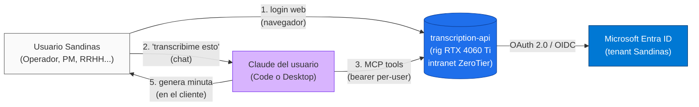
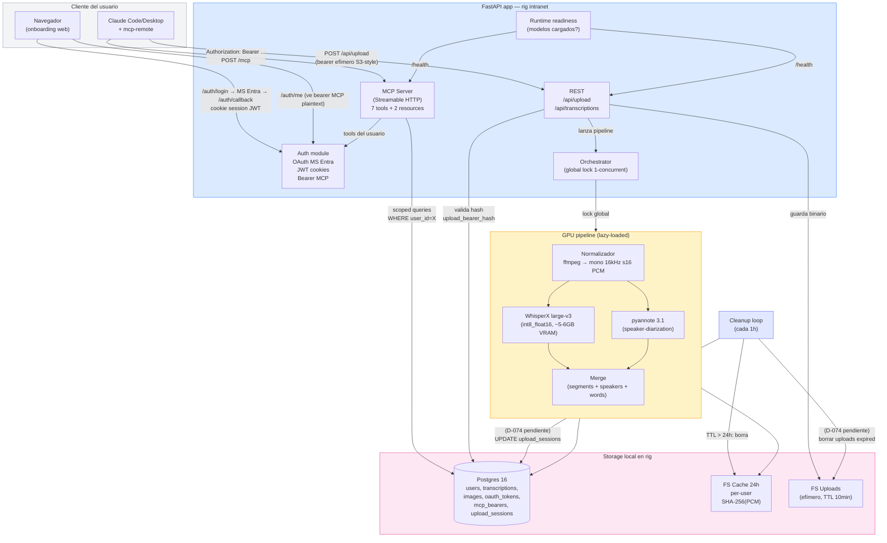
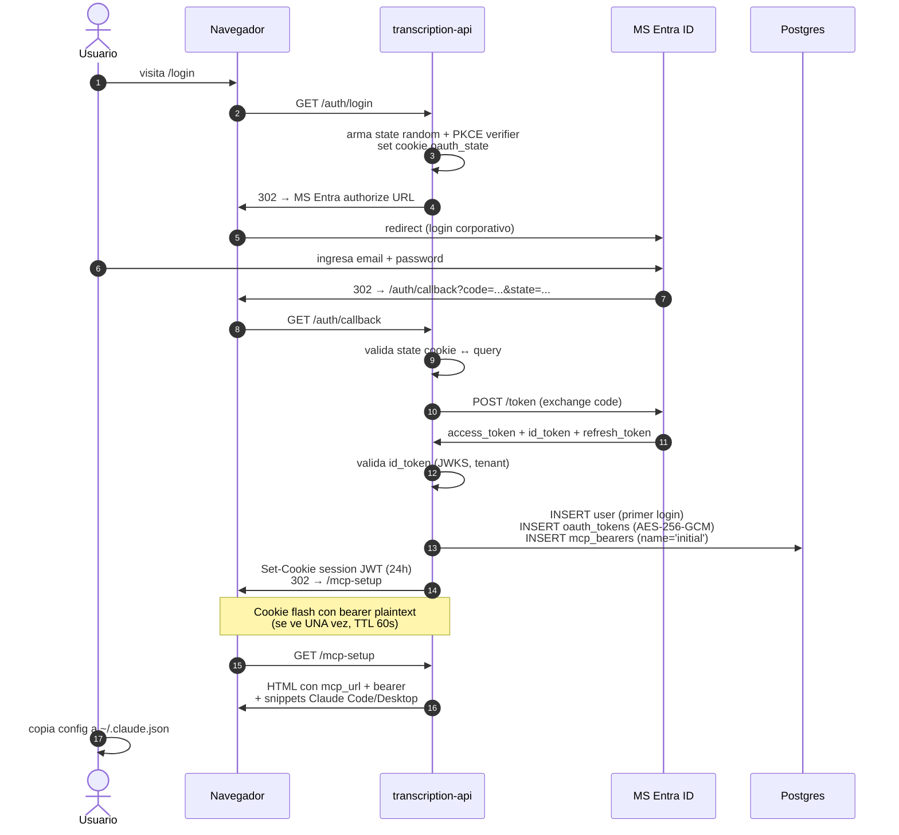
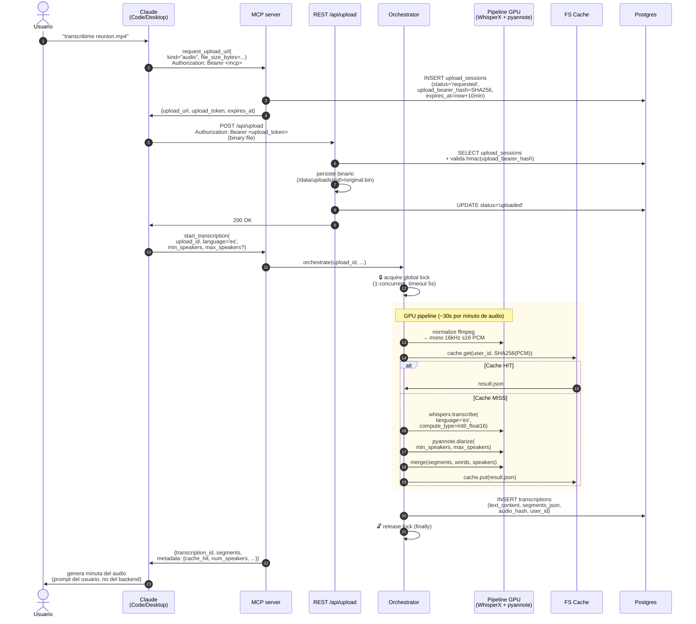
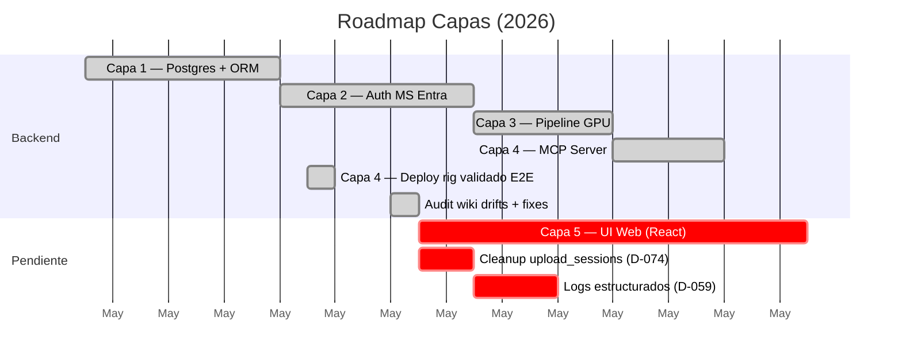

# transcription-api — Arquitectura para el equipo (2026-05-11)

> Documento de soporte para reunión con el equipo. Refleja el estado post-audit del 2026-05-11 (Capas 1-4 mergeadas, Capa 5 UI pendiente).

---

## 1. Qué hace el sistema, en una frase

> Recibe audio o video, devuelve transcripción en español con diarización (quién habla cuándo), persistida 24h, expuesta como tools al Claude del usuario para que genere minutas.

**Lo que NO hace**: generar minutas. Eso lo hace el Claude personal del usuario consumiendo nuestros datos vía MCP.

---

## 2. Quién usa el sistema (Context)

### Decisiones clave de scope

| Decisión | Por qué |
|---|---|
| **Self-hosted en intranet**, no cloud | Privacy. Los audios contienen reuniones internas (RRHH, comercial). Salir a OpenAI/AssemblyAI = data de Sandinas en un proveedor externo. |
| **Microsoft Entra SSO**, no auth propia | Reutiliza la identidad corporativa. Cuando un empleado se va, MS desactiva la cuenta → bearer queda revocado al próximo intento. |
| **MCP-first, REST mínimo** | El consumidor principal es Claude. MCP es nativo para tools/resources con auth por bearer. REST queda solo para upload de blobs (no transportable eficientemente por MCP). |
| **Minutas en el cliente, no en el backend** | El backend solo provee datos. La minuta la construye Claude con sus propios prompts del usuario → cada uno la genera como prefiere sin que el backend tenga que mantener templates. |

---

## 3. Componentes internos (Container)

### Stack en una tabla

| Capa | Tech | Por qué |
|---|---|---|
| Lenguaje | Python 3.10 | FastAPI + ML libs nativas |
| Web framework | FastAPI 0.115 + Uvicorn 0.32 | Async nativo, OpenAPI, integración con MCP |
| MCP | `mcp[server]` 1.5.x (SDK Anthropic) | Streamable HTTP transport |
| STT | WhisperX 3.8.5 + Whisper large-v3 (`int8_float16`) | Mejor relación WER/VRAM en español; cabe en 8GB junto con pyannote |
| Diarización | pyannote.audio 3.1 (`speaker-diarization-3.1`) | Más preciso que Sortformer en español |
| DB | Postgres 16-alpine | FTS español + GIN tsvector para search |
| Auth | Microsoft Entra ID OAuth 2.0 / OIDC + itsdangerous + cryptography (AES-256-GCM) | SSO corporativo |
| Infra | Docker + nvidia-container-toolkit | GPU pass-through al container |

---

## 4. Flujo 1 — Onboarding del usuario

### Notas para la reunión

- **El bearer MCP se muestra UNA SOLA VEZ** post-login (cookie flash). Si el usuario lo pierde, debe `POST /auth/regenerate-mcp-token` para emitir uno nuevo (revoca el anterior).
- **No usamos session-based auth en el MCP**: cookie del browser ≠ bearer del cliente programático. Son dos canales separados (web vs Claude headless).
- **Per-user scoping fail-closed** (ADR-015/016): cada query ORM contra modelos del usuario inyecta `WHERE user_id=X` automáticamente. Si alguna ruta olvida armar el listener, las queries levantan `ScopingNotArmedError` en vez de leakear filas de otros users.

---

## 5. Flujo 2 — Transcripción end-to-end

### Notas para la reunión

- **El "rig" hace 1 transcripción a la vez** (lock global, ADR-005). Si llega un segundo request mientras hay otro corriendo, espera hasta 5s; si el lock sigue ocupado, devuelve `GPU_BUSY` con `Retry-After: 600`.
- **Cache es per-user + por hash del PCM** (no del WAV completo). Significa: el mismo audio subido dos veces por el mismo user → segundo es instantáneo. Pero el mismo audio subido por dos users distintos → se procesa dos veces (Privacy).
- **Bearer efímero para uploads** (ADR-017): el bearer MCP del cliente NO viaja al endpoint `/api/upload`. En su lugar, `request_upload_url` emite un secreto distinto con TTL 10min que sí viaja en el upload. Razón: el bearer MCP es de larga duración; si un proxy loguea el header, leak indefinido. El efímero limita el blast radius a 10 minutos.

---

## 6. Estado del proyecto (capas)

### Capas hechas

| Capa | Qué entregó |
|---|---|
| **Capa 1** | Postgres testcontainer, ORM SQLAlchemy 2.x async, 6 modelos, alembic migrations, per-user scoping listener, FTS español, GIN indexes |
| **Capa 2** | OAuth 2.0 con MS Entra (PKCE, JWKS rotation, tenant guard), JWT session cookies, bearer MCP per-user, regenerate flow, scoping fail-closed (ADR-015) + defensa en capas (ADR-016) |
| **Capa 3** | Dockerfile con CUDA 12.1 + extras pipeline, lifespan que carga modelos, normalize ffmpeg, WhisperX wrapper, pyannote wrapper, merge, orchestrator con lock global, REST endpoints |
| **Capa 4** | MCP server Streamable HTTP, 7 tools (upload, start, get, list, search, delete, user_info), 2 resources, bearer middleware, image upload unificado bajo `request_upload_url(kind="image")`, scoping classification guard (ADR-016) |
| **Audit 2026-05-11** | 40 drifts wiki↔código documentados; 4 CRITICAL cerrados (D-050 ADR-017, D-052 taxonomía errores, D-080 magic-byte fallback, D-081 MCP URL `/mcp`) |

### Capas pendientes

| Capa | Por qué importa |
|---|---|
| **Capa 5 — UI Web** | Hoy el onboarding es CLI-only (el usuario tiene que ver el bearer en una respuesta JSON). RF-UI-01/02 en wiki marcadas `Pendiente Capa 5`. Stack planeado: React 18 + Vite 5 + Tailwind, servida por FastAPI StaticFiles. |
| **D-074 Cleanup uploads** | Drift detectado en audit: si un cliente con bug llama `request_upload_url` sin completar el POST, los bytes en `/data/uploads/` solo se borran al reiniciar el container. Disk leak. |
| **D-059 Logs estructurados** | Wiki declara 14+ eventos contractuales (`auth_login_started`, `stt_completed`, etc.) que el código no emite. Auditabilidad cero hasta que se cierre. |

---

## 7. Decisiones técnicas clave (decision priority)

`Privacy > Simplicity > Transcription Quality > Performance > Cost`

| Decisión | Trade-off |
|---|---|
| **ADR-001**: WhisperX `int8_float16` (no float16) | Cabe en 8GB junto con pyannote. WER ~5% peor que float16, aceptable. |
| **ADR-002**: pyannote 3.1, no Sortformer | Sortformer es 2-3% mejor en inglés pero peor en español (rioplatense específicamente). |
| **ADR-003**: API síncrona, no async + queue | Volumen esperado bajo (10-30 jobs/día). Async = complejidad sin ganancia visible. |
| **ADR-004**: Filesystem cache, no Redis | Disco es 1000× más barato; los archivos JSON son pocos KB; TTL 24h con cleanup periódico cierra el caso. |
| **ADR-005**: Lock global 1-concurrent | 8GB VRAM no permite 2 transcripciones simultáneas. Lock es lo más simple; un cliente que llega cuando hay otro corriendo recibe 503 + Retry-After. |
| **ADR-013 → ADR-017**: Upload con bearer efímero S3-style | Privacy: bearer MCP de larga duración leakable en access logs era riesgo aceptable solo si todos los proxies redactaran `Authorization`. Bearer efímero TTL 10min limita blast radius. |
| **ADR-014 → ADR-015**: Listener fail-closed | Si una ruta olvida armar `user_id` en la sesión, queries levantan `ScopingNotArmedError` en vez de devolver todas las filas. |
| **ADR-016**: Defensa en capas para scoping | Si alguien agrega un modelo sin columna `user_id`, el container no arranca (startup classification guard). |

---

## 8. Para la reunión: 3 conversaciones a tener

1. **¿Cuándo arrancamos Capa 5 (UI web)?** Hoy el onboarding es técnico (copiar bearer de JSON). Si vamos a expandir el uso al equipo no-técnico, la UI es bloqueante.

2. **¿Implementamos D-074 (cleanup uploads) en sprint inmediato o downgradamos a Pendiente Capa 5?** El disk leak es real pero el blast radius depende de cuánto vaya a crecer el uso. Decisión técnica simple, costo bajo.

3. **¿Quiénes van a tener acceso?** El bearer MCP es per-user pero no hay control de quotas. Si N personas del equipo usan la API en paralelo y N > 1, todos comparten el rig (lock global). ¿Está bien? ¿Hay que considerar Cloud Run para escalar después?

---

## Apéndice: documentos relacionados

- Wiki: `wiki/01_alcance_funcional.md`, `wiki/02_arquitectura.md`, `wiki/05_modelo_datos.md`
- ADRs: `wiki/ADR/ADR-001.md` a `ADR-017.md`
- RFs: `wiki/RF/RF-AUTH.md`, `RF-TRX.md`, `RF-CACHE.md`, `RF-MCP.md`, `RF-IMG.md`, `RF-UI.md` (Pendiente Capa 5)
- Drift log: `docs/sesiones/2026-05-05-wiki-drifts.md` (D-001 a D-049) + `docs/sesiones/2026-05-11-wiki-drift-audit.md` (D-050 a D-089)
- Demo previa: `Presentacion/demo-todolist/` (Spec-Driven Development metodología)
