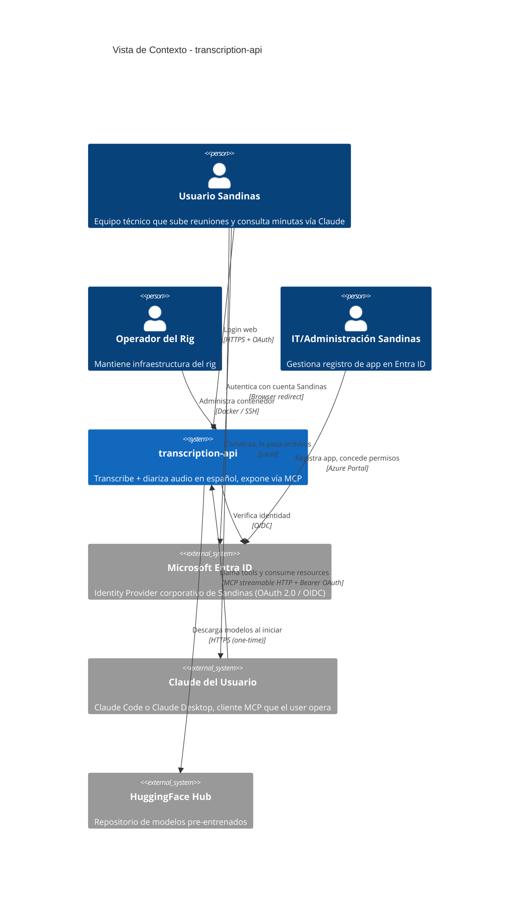
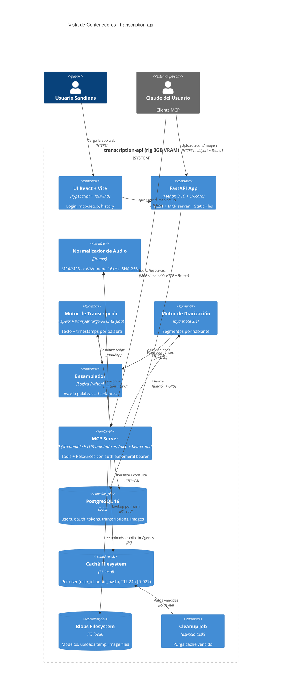
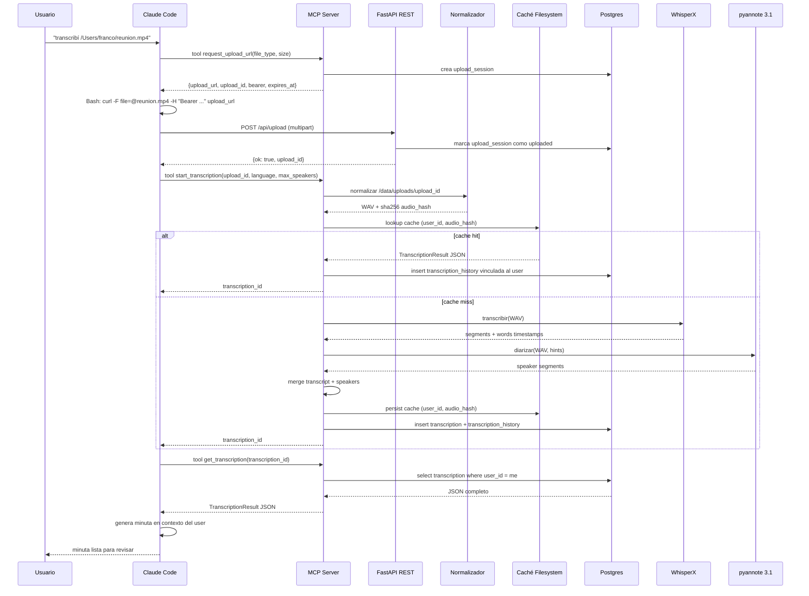
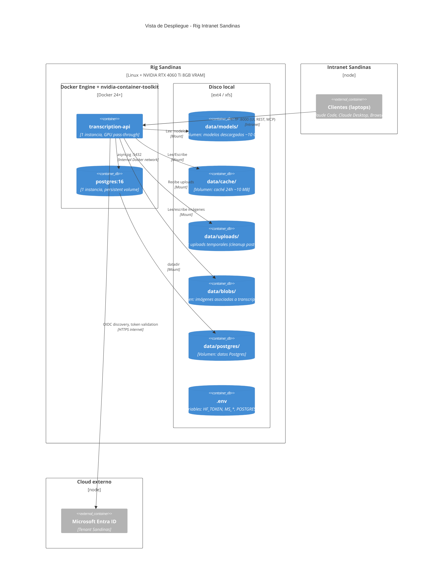

# Arquitectura — `transcription-api`

## 0. Prioridad de Decisiones del Proyecto (Fuente de verdad)

**Privacy > Simplicity > Transcription Quality > Performance > Cost**

Este orden gobierna todos los tradeoffs y es la referencia para `AGENTS.md` / `CLAUDE.md`. Privacidad primero porque las reuniones contienen información sensible (decisiones técnicas, procesos de clientes). Simplicidad segundo por la realidad operativa (single admin, sin SRE). Calidad tercero porque el alcance exige no escapar detalles. Performance acepta hasta 12 min/h de audio. Costo último porque el self-hosting ya lo minimizó.

## 1. Resumen Ejecutivo

API multi-tenant con frontend mínimo y servidor MCP que recibe archivos de audio/video de los usuarios autenticados, devuelve transcripción diarizada en español, y expone esos datos vía MCP para que el Claude personal de cada usuario pueda generar minutas. Stack: FastAPI + WhisperX (Whisper large-v3 cuantizado int8_float16 + pyannote 3.1) + ffmpeg + PostgreSQL + React/Vite, sobre Docker con GPU pass-through en un rig privado con NVIDIA RTX 4060 Ti 8 GB VRAM en intranet de Sandinas. Autenticación con Microsoft Entra ID OAuth 2.0. La generación de minutas ocurre en el Claude del usuario (no en el backend); el backend mantiene la transcripción y las imágenes asociadas, expuestas vía tools y resources MCP. Decisiones críticas: pipeline síncrono ([ADR-003](ADR/ADR-003.md)), caché efímero por audio_hash en filesystem ([ADR-004](ADR/ADR-004.md)), datos persistentes en Postgres ([ADR-008](ADR/ADR-008.md)), Microsoft Entra ID SSO ([ADR-009](ADR/ADR-009.md)), UI React mínima ([ADR-010](ADR/ADR-010.md)), MCP-first con REST mínimo ([ADR-011](ADR/ADR-011.md)), minutas en Claude del user ([ADR-012](ADR/ADR-012.md)), uploads HTTP con bearer efímero S3-style ([ADR-017](ADR/ADR-017.md), reemplaza [ADR-013](ADR/ADR-013.md)).

## 2. Vista de Contexto (C4 Nivel 1)

## 3. Vista de Contenedores (C4 Nivel 2)

## 4. Secuencia Crítica — User pasa MP4 a Claude Code, recibe minuta

**Camino de error**: si `request_upload_url` falla por OAuth inválido → 401 al cliente. Si curl falla por timeout (archivo > 500MB) → user reintenta o sube partes. Si `start_transcription` falla por CUDA OOM → 500 con `error_code` (RF-TRX-05). Si `get_transcription` se invoca antes de que el pipeline termine → estado `processing` (puede pollear o esperar long-poll del MCP).

## 5. Responsabilidad de Microservicios

> El sistema es un único proceso FastAPI. Esta tabla documenta los componentes lógicos y su ownership.

| Componente | Responsabilidad principal | Datos/estado que gobierna | Dependencias clave |
|---|---|---|---|
| UI React + Vite | Onboarding visual: login, mostrar config MCP | Cookie de sesión web | Backend OAuth endpoints |
| FastAPI App (REST) | Auth flow, uploads binarios, healthcheck, sirve UI estática | Sesiones web, uploads en `/data/uploads/` | Postgres, Microsoft Entra |
| MCP Server | Tools + Resources, lifecycle de transcripciones. Montado en `/mcp` con `BearerAuthMiddleware` que valida `Authorization: Bearer <plaintext>` contra `mcp_bearers.token_hash` (SHA-256), arma los ContextVars `_current_user_id` / `_current_bearer_id` y snapshotea los modelos del lifespan en `_current_whisper_model` / `_current_pyannote_pipeline` / `_current_models_status` para los tools (G12). Las queries por user usan `scoped_session(user_id)` (`db/session.py`), que dispara el listener fail-closed de [ADR-015](ADR/ADR-015.md) con la defensa en capas de [ADR-016](ADR/ADR-016.md). | Bearer tokens en Postgres | Postgres, pipeline, caché |
| Normalizador de Audio | ffmpeg + SHA-256 | Tempfiles transitorios | ffmpeg binario |
| Motor de Transcripción | Whisper large-v3 vía WhisperX | Modelo en VRAM | GPU, modelos en `/data/models/` |
| Motor de Diarización | pyannote 3.1 | Modelo en VRAM | GPU, HF token |
| Ensamblador | Asignar palabras a hablantes | Stateless | WhisperX util |
| Caché Filesystem | Idempotencia 24h per-user por `(user_id, audio_hash)` (D-027) | `/data/cache/<user_id>/<audio_hash>/result.json` | Disco |
| PostgreSQL 16 | Datos persistentes con identidad | `users`, `oauth_tokens`, `transcriptions`, `transcription_history`, `images`, `upload_sessions` | Volumen Docker |
| Cleanup Job | Purga caché vencido | Stateless | Caché |

## 6. Stack Tecnológico

| Componente | Tecnología | Motivo (vinculado a Prioridad) | Riesgo principal | Mitigación |
|---|---|---|---|---|
| API HTTP | FastAPI 0.115 + Uvicorn 0.32 | Estándar Python; async; OpenAPI; compatible con MCP SDK (Simplicidad) | Versión Python con CUDA wheels específica | Pinear 3.10/3.11 en Dockerfile |
| MCP Server | `mcp` SDK Anthropic + auth middleware custom | Único SDK oficial; transport streamable HTTP integrado | SDK joven, breaking changes posibles | Pinear versión; tests de contrato |
| STT | WhisperX 3.8.5 + Whisper large-v3 (int8_float16) | Framework con diarización integrada (Simplicidad); calidad probada en español; cuantización requerida por VRAM 8 GB del rig ([ADR-001](ADR/ADR-001.md)) | Mejora marginal vs Canary; ~+0,5pp WER por cuantización | Validación empírica Capa 4. Loader lazy via indirección `_whisperx_load_model(...)` (D-030) — el módulo `pipeline.stt` es importable sin extras `[pipeline]` instalados; sólo invocar el loader requiere la lib pesada (testability + dev box CPU-only). |
| Diarización | pyannote 3.1 | Multilingüe maduro; integra WhisperX ([ADR-002](ADR/ADR-002.md)) | Requiere HF token | Aceptar términos en Fase 0 (TRES modelos gated, ver [RF-TRX](RF/RF-TRX.md) §Prerrequisitos HF). Loader lazy via indirección `_pyannote_from_pretrained(...)` (D-028 + D-030) por el mismo motivo que STT. |
| Audio | ffmpeg 6.x | Universal, todos los codecs (Simplicidad) | Codec raro falla | `-err_detect ignore_err` + tests con MP4 reales |
| Caché efímero (24h) | Filesystem local | Sin dependencias; debug trivial ([ADR-004](ADR/ADR-004.md)) | TTL manual | Cleanup job |
| Persistencia (users, history, tokens) | PostgreSQL 16 | Transacciones, queries SQL, JSONB ([ADR-008](ADR/ADR-008.md)) | Otro container | Healthcheck + volumen persistente |
| Frontend | React 18 + Vite 5 + Tailwind 3 | Tooling estándar; 2 páginas, scope acotado ([ADR-010](ADR/ADR-010.md)) | Scope creep | ADR explicita "scope prohibido" |
| Auth | Microsoft Entra ID OIDC + `authlib` o `msal` | Reutiliza identidad corporativa ([ADR-009](ADR/ADR-009.md)) | Outage del tenant | Aceptable para uso interno |
| Empaquetado | Docker + nvidia-container-toolkit | Reproducibilidad ([ADR-006](ADR/ADR-006.md)) | Imagen pesada | One-time cost |
| Observabilidad | Logs estructurados (stdlib `logging` + JSON formatter) | Sin servicios externos (Privacy + Simplicidad) | Sin métricas históricas | Endpoint `/health` |

## 7. Decisiones de Arquitectura

| ID | Título | Estado | Fecha | Impacto |
|---|---|---|---|---|
| [ADR-001](ADR/ADR-001.md) | Stack STT — WhisperX (Whisper large-v3) | Aceptada | 2026-04-30 | §6 stack, §3 contenedores |
| [ADR-002](ADR/ADR-002.md) | Diarización — pyannote 3.1 sobre Sortformer | Aceptada | 2026-04-30 | §6 stack, §3 contenedores |
| [ADR-003](ADR/ADR-003.md) | API síncrona sin queue ni callbacks | Aceptada | 2026-04-30 | §4 secuencia, §1 resumen |
| [ADR-004](ADR/ADR-004.md) | Caché efímero en filesystem sin BD | Aceptada (parcialmente reemplazada por ADR-008) | 2026-04-30 | §3 contenedores, §5 responsabilidades |
| [ADR-005](ADR/ADR-005.md) | Lock global, 1 request por vez | Aceptada | 2026-04-30 | §4 secuencia, §8 resiliencia |
| [ADR-006](ADR/ADR-006.md) | Docker + nvidia-container-toolkit | Aceptada | 2026-04-30 | §9 despliegue, §6 stack |
| [ADR-007](ADR/ADR-007.md) | Identificación de caché por SHA-256 del audio normalizado | Aceptada | 2026-04-30 | §3 contenedores, §4 secuencia |
| [ADR-008](ADR/ADR-008.md) | PostgreSQL para datos persistentes (reemplaza ADR-004 parcial) | Aceptada | 2026-04-30 | §3, §5, §6 — agrega componente Postgres |
| [ADR-009](ADR/ADR-009.md) | Microsoft Entra ID OAuth 2.0 / OIDC | Aceptada | 2026-04-30 | §2, §3, §4 — agrega Entra como sistema externo |
| [ADR-010](ADR/ADR-010.md) | React + Vite UI mínima | Aceptada | 2026-04-30 | §3, §6 — agrega componente UI |
| [ADR-011](ADR/ADR-011.md) | MCP Server como protocolo principal + REST mínimo para blobs | Aceptada | 2026-04-30 | §3, §4 — define superficie de integración |
| [ADR-012](ADR/ADR-012.md) | Generación de minutas en Claude del user | Aceptada | 2026-04-30 | §1 alcance, §3 — ningún componente backend genera minutas |
| [ADR-013](ADR/ADR-013.md) | Upload de blobs vía endpoints HTTP autenticados (Opción A original con bearer MCP) | Reemplazada por ADR-017 | 2026-04-30 | §3, §4 — versión histórica; ver ADR-017 para el patrón as-built |
| [ADR-014](ADR/ADR-014.md) | Per-user scoping enforcement vía SQLAlchemy event listener | Reemplazada por ADR-015 | 2026-05-04 | §3 — versión fail-open original |
| [ADR-015](ADR/ADR-015.md) | Listener de scoping fail-closed + `bypass_scoping` context manager | Aceptada | 2026-05-05 | §3, §8 — query sin `user_id` armado raise `ScopingNotArmedError`; bypass explícito vía context manager |
| [ADR-016](ADR/ADR-016.md) | Defensa en capas para per-user scoping (startup classification + listener) | Aceptada | 2026-05-07 | §8 — startup guard complementa listener fail-closed; modelo nuevo sin `user_id` rompe boot en lugar de leak silencioso |
| [ADR-017](ADR/ADR-017.md) | Upload con bearer efímero per-upload (S3-style) | Aceptada | 2026-05-11 | §3, §4 — Privacy: blast radius ≤10 min vs bearer MCP indefinido; formaliza patrón as-built en Capa 4 (`upload_bearer_hash` + `hmac.compare_digest`) |
| [ADR-018](ADR/ADR-018.md) | Desactivación de DNS rebinding protection en MCP transport | Aceptada | 2026-05-11 | §3, §8 — bearer auth + red privada como frontera de confianza; allowlist por CIDR sería frágil para ZeroTier/LAN |

## 8. Seguridad, Observabilidad y Resiliencia

**Seguridad**:
- Autenticación obligatoria en todos los endpoints excepto `/api/health`, `/auth/login`, `/auth/callback`, `/`. Implementada vía Microsoft Entra ID OIDC ([ADR-009](ADR/ADR-009.md)).
- Bearer tokens vinculados a `user_id` en Postgres; revocables desde la UI.
- Cookie web de sesión: `HttpOnly`, `Secure`, `SameSite=Strict`, JWT firmado con clave del backend.
- Per-user scoping estricto en MCP: cada tool y resource opera bajo la identidad del bearer. Implementado en código via SQLAlchemy `do_orm_execute` event listener ([ADR-015](ADR/ADR-015.md), reemplaza [ADR-014](ADR/ADR-014.md)) que inyecta `WHERE user_id = X` automáticamente cuando `session.info["user_id"]` está seteado por el middleware. **Fail-closed por defecto**: una query contra un per-user model sobre una sesión sin `user_id` armado ni `scoping_bypass` raise `ScopingNotArmedError` (no leak silencioso). Bypass explícito vía `with bypass_scoping(session): ...` para auth lookups y mantenimiento administrativo.
- Secretos (HF_TOKEN, Postgres password, JWT secret, MS app client secret) en `.env` montado al contenedor; nunca commiteados.
- Logs redactan el header `Authorization` para no exponer bearers en disco.
- Validación de inputs en frontera (FastAPI + Pydantic): tamaño máximo de upload, formato, parámetros numéricos, validación de UUIDs.

**Observabilidad**:
- Correlation ID por request (UUID generado en middleware, propagado en logs).
- Logs estructurados JSON con: `request_id`, `user_id` (si autenticado), `stage`, `duration_ms`, `cache_hit`, `error_code` (si aplica).
- Endpoint `GET /api/health` reporta: `gpu_available`, `vram_free_mb`, `cache_entries_count`, `cache_size_mb`, `db_reachable`, `models_loaded`.

**Resiliencia**:
- Modelos cargados al startup (FastAPI lifespan); request no paga el costo de carga (~30s).
- Lock global con timeout (5 s espera, luego 503 + `Retry-After`) — ADR-005.
- Cleanup automático de caché vencido cada hora.
- Tempfiles de audio normalizado borrados en `finally`.
- Postgres healthcheck en compose; si DB no llega, FastAPI espera 30s antes de fail.
- Health check de Docker: si `/api/health` falla 3 veces seguidas, `docker compose restart` el contenedor.
- Pool de conexiones asyncpg con limit; reconexión automática.

## 9. Vista de Despliegue

## 10. Insumos para FL

| Flow candidato | Actor principal | Servicios involucrados | Estado/Evento crítico | Riesgo técnico |
|---|---|---|---|---|
| FL-AUTH-01 | Usuario | UI, FastAPI Auth, Microsoft Entra | OAuth callback exitoso → user creado/actualizado en Postgres | Outage de Entra |
| FL-MCP-01 | Usuario | UI, FastAPI Auth, Postgres | Mostrar config MCP con bearer regenerable | Bearer expuesto en logs |
| FL-TRX-01 (revisado) | Usuario via Claude | Claude Code, MCP Server, REST upload, Normalizador, STT, Diarización, Ensamblador, Caché, Postgres | `cache_miss` → procesa pipeline; persiste en Postgres histórico | CUDA OOM; ffmpeg falla |
| FL-TRX-02 (revisado) | Usuario via Claude | Claude Code, MCP Server, Caché, Postgres | `cache_hit` → retorna sin invocar modelos; sigue persistiendo histórico | Hash colisión despreciable |
| FL-TRX-03 (cleanup) | Cleanup Job | Caché Filesystem | Purga entradas vencidas | Permission errors |
| FL-MIN-01 | Usuario via Claude | Claude del user, MCP Server (read), Postgres | Genera minuta en contexto Claude usando tools/resources | Privacy si user copia transcript a otro lado |
| FL-IMG-01 | Usuario via Claude | Claude Code, MCP Server, REST upload-image, Postgres + Filesystem | Asocia imagen a transcripción existente | Imagen huérfana si attach falla |

Estados/eventos clave:
- Auth: `unauthenticated` → `authenticating` → `authenticated` → (`session_active` ↔ `session_expired`) → `logged_out`.
- Upload: `requested` → `uploaded` → `processing` → (`completed` | `failed`).
- Transcription: `processing` → `completed` (entry visible en MCP).
- Image: `requested` → `uploaded` → `attached` (a transcripción).

Cuellos de botella conocidos:
- Lock global (ADR-005) limita throughput a 1 request por vez.
- Carga inicial de modelos: ~30 s al arrancar.
- Disco lleno: caché o Postgres bloquean escritura.

Preguntas abiertas: **0** (todas las decisiones críticas en ADRs).

Checklist:
- [x] Cada flow tiene actor y dueño técnico claros.
- [x] Cada flow tiene estados/eventos mínimos definidos.
- [x] No quedan decisiones críticas abiertas.
- [x] El contenido alcanza para iniciar `crear-flujo` sin supuestos implícitos.

## 11. Supuestos y Límites

**Supuestos**:
1. El rig tiene GPU NVIDIA con drivers ≥ 535 y CUDA 12.1+ instalado.
2. HuggingFace aprueba el acceso a `pyannote/speaker-diarization-3.1` con el token de Sandinas.
3. Volumen de procesamiento ≤ 5 reuniones/día (concurrencia esperada cercana a cero).
4. Disco ≥ 100 GB libres (modelos + cache + Postgres + uploads).
5. Sandinas tiene tenant Microsoft Entra ID activo con permisos para registrar app.
6. Cada user tiene Claude Code o Claude Desktop instalado (para integración MCP).

**Fuera de alcance técnico**:
1. Multi-GPU / clustering.
2. Live transcription / streaming.
3. Object storage externo (S3/MinIO) — uploads van al filesystem del rig.
4. Generación de minutas en backend (siempre en Claude del user).
5. Soporte para clientes MCP que no sean Claude.
