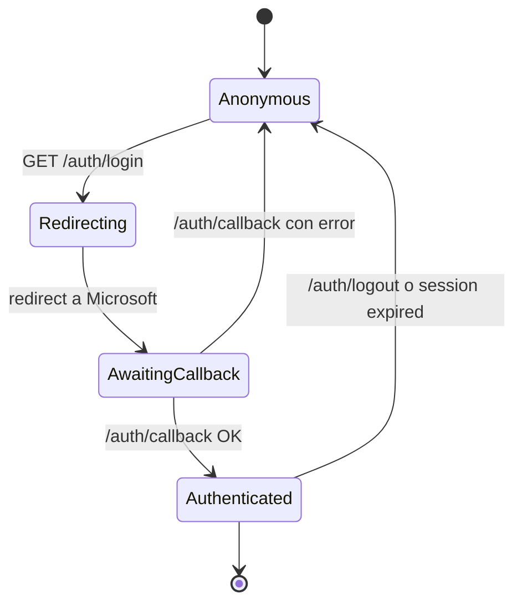
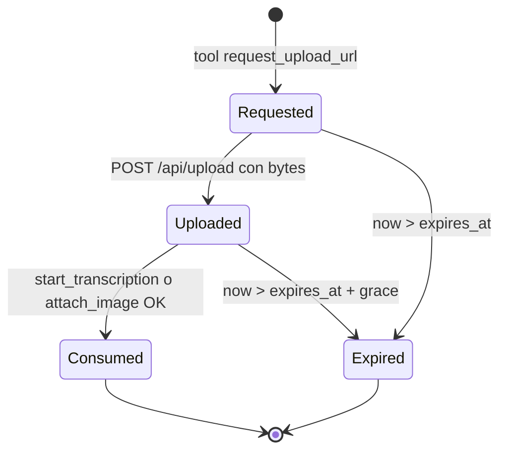
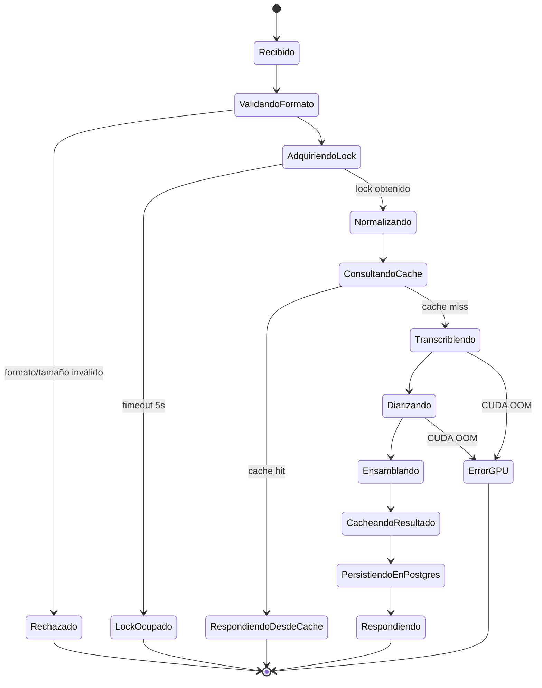

# Modelo de Datos — `transcription-api`

## Aclaración importante

La persistencia se divide en **dos capas** según [ADR-008](ADR/ADR-008.md):

- **PostgreSQL 16**: datos con identidad de usuario (users, tokens, transcripciones históricas, imágenes, sesiones de upload). Transacciones ACID, queries SQL, JSONB para metadatos flexibles.
- **Filesystem local**: caché efímero por `audio_hash` (idempotencia del pipeline, TTL 24 h, regido por [ADR-004](ADR/ADR-004.md) parcialmente vigente), modelos pre-descargados, blobs binarios de imágenes y uploads temporales.

[ADR-004](ADR/ADR-004.md) sigue vigente para el caché efímero de pipeline. [ADR-008](ADR/ADR-008.md) lo reemplaza parcialmente al introducir Postgres para datos persistentes con identidad.

## 1. Layout del Filesystem

```
<DATA_DIR>/
├── models/                                # Modelos pre-descargados (volumen Docker)
│   ├── whisperx/large-v3/
│   ├── whisperx/alignment/wav2vec2-es/
│   └── pyannote/speaker-diarization-3.1/
├── cache/                                 # Caché efímero per-user 24h (RF-TRX-02, D-027)
│   ├── <user_id>/                         # Aislamiento por usuario (Privacy > Performance)
│   │   ├── 8f3a7e2c1b...0d (sha256, 64 chars)/
│   │   │   └── result.json                # TranscriptionResult completo; TTL = file mtime
│   │   └── ...
│   └── ...
├── uploads/                               # Uploads temporales pre-pipeline
│   ├── <upload_id>/                       # Borrado tras start_transcription
│   │   └── original.bin
│   └── ...
└── blobs/                                 # Imágenes adjuntas a transcripciones
    └── <user_id>/<transcription_id>/<image_id>.<ext>
```

## 2. Schema de PostgreSQL

### Tabla `users`

| Columna | Tipo | Constraints | Descripción |
|---|---|---|---|
| `id` | `UUID` | PK, default `gen_random_uuid()` | ID interno |
| `microsoft_oid` | `UUID` | UNIQUE NOT NULL | `oid` del token Microsoft Entra ID |
| `email` | `TEXT` | NOT NULL | Email corporativo Sandinas |
| `display_name` | `TEXT` | NOT NULL | Nombre de display |
| `created_at` | `TIMESTAMPTZ` | NOT NULL DEFAULT `now()` | Primer login |
| `last_login_at` | `TIMESTAMPTZ` | NOT NULL DEFAULT `now()` | Último login |

Constraints UNIQUE (Postgres las implementa como índices únicos visibles en `pg_indexes`): `uq_users_email`, `uq_users_microsoft_oid`. Convención: `uq_*` para constraints, `idx_*` para índices propiamente dichos.

### Tabla `oauth_tokens`

Tokens de Microsoft Entra ID encriptados. Refresh token rota; access token corta vida.

| Columna | Tipo | Constraints | Descripción |
|---|---|---|---|
| `id` | `UUID` | PK | |
| `user_id` | `UUID` | FK `users(id)` ON DELETE CASCADE | |
| `ms_access_token_encrypted` | `BYTEA` | NOT NULL | Encriptado con clave del backend |
| `ms_refresh_token_encrypted` | `BYTEA` | NOT NULL | Encriptado |
| `ms_access_expires_at` | `TIMESTAMPTZ` | NOT NULL | |
| `created_at` | `TIMESTAMPTZ` | NOT NULL DEFAULT `now()` | |
| `updated_at` | `TIMESTAMPTZ` | NOT NULL DEFAULT `now()` | |

Constraint UNIQUE: `uq_oauth_tokens_user_id` — un solo token activo por user.

### Tabla `mcp_bearers`

Bearer tokens emitidos por la app para que el Claude del usuario consuma el MCP server. Solo se almacena el hash; el token plano se entrega una sola vez al user.

| Columna | Tipo | Constraints | Descripción |
|---|---|---|---|
| `id` | `UUID` | PK | |
| `user_id` | `UUID` | FK `users(id)` ON DELETE CASCADE | |
| `token_hash` | `TEXT` | NOT NULL UNIQUE | SHA-256 hex del token plano |
| `name` | `TEXT` | NULL | Etiqueta opcional ("Claude Code laptop", etc.) |
| `created_at` | `TIMESTAMPTZ` | NOT NULL DEFAULT `now()` | |
| `last_used_at` | `TIMESTAMPTZ` | NULL | Actualizado a cada request MCP |
| `revoked_at` | `TIMESTAMPTZ` | NULL | NULL = activo; valor = revocado |

Index: `idx_mcp_bearers_user_id`. Constraint UNIQUE: `uq_mcp_bearers_token_hash`. Índice parcial UNIQUE: `uq_mcp_bearers_active_per_user` sobre `(user_id) WHERE revoked_at IS NULL` — al menos un bearer activo por user (RF-AUTH-07).

### Tabla `transcriptions`

Histórico persistente. Una entrada por cada `start_transcription` exitoso. No tiene TTL (retención hasta borrado manual del user).

| Columna | Tipo | Constraints | Descripción |
|---|---|---|---|
| `id` | `UUID` | PK | |
| `user_id` | `UUID` | FK `users(id)` ON DELETE CASCADE | Owner |
| `audio_hash` | `TEXT` | NOT NULL | SHA-256 del WAV normalizado; clave del caché efímero |
| `original_filename` | `TEXT` | NOT NULL | |
| `original_size_bytes` | `BIGINT` | NOT NULL | |
| `duration_seconds` | `NUMERIC(10,2)` | NOT NULL | |
| `language` | `TEXT` | NOT NULL | ISO 639-1, típicamente `"es"` |
| `num_speakers` | `INTEGER` | NOT NULL | |
| `text` | `TEXT` | NOT NULL | Concatenación de segments para full-text search |
| `segments` | `JSONB` | NOT NULL | Estructura completa con words, timestamps, speakers |
| `metadata` | `JSONB` | NOT NULL | `{model, diarizer, processing_seconds, rtf}` |
| `created_at` | `TIMESTAMPTZ` | NOT NULL DEFAULT `now()` | |
| `deleted_at` | `TIMESTAMPTZ` | NULL | Soft delete |

Index:
- `idx_transcriptions_user_created` (`user_id`, `created_at DESC`) WHERE `deleted_at IS NULL`.
- `idx_transcriptions_audio_hash` (`audio_hash`).
- `idx_transcriptions_text_fts` GIN (`to_tsvector('spanish', text)`) WHERE `deleted_at IS NULL` — full-text search parcial, alineado con el filtro de `idx_transcriptions_user_created` para que el planner combine ambos índices sin recheck sobre filas borradas.

### Tabla `images`

Imágenes asociadas a transcripciones (capturas durante reuniones). Metadatos en Postgres, binario en filesystem.

| Columna | Tipo | Constraints | Descripción |
|---|---|---|---|
| `id` | `UUID` | PK | |
| `transcription_id` | `UUID` | FK `transcriptions(id)` ON DELETE CASCADE | |
| `user_id` | `UUID` | FK `users(id)` ON DELETE CASCADE | Redundante para queries de scope |
| `filename` | `TEXT` | NOT NULL | Original del user |
| `caption` | `TEXT` | NULL | Caption opcional para la minuta |
| `mime_type` | `TEXT` | NOT NULL | `image/png`, `image/jpeg`, etc. |
| `size_bytes` | `BIGINT` | NOT NULL | |
| `file_path` | `TEXT` | NOT NULL | Path relativo en `<DATA_DIR>/blobs/` |
| `created_at` | `TIMESTAMPTZ` | NOT NULL DEFAULT `now()` | |
| `deleted_at` | `TIMESTAMPTZ` | NULL | Soft delete |

Index: `idx_images_transcription_id`, `idx_images_user_id`.

### Tabla `upload_sessions`

Sesiones efímeras de upload binario. Vinculan el `request_upload_url` (tool MCP) con el `POST /api/upload` (REST endpoint).

| Columna | Tipo | Constraints | Descripción |
|---|---|---|---|
| `id` | `UUID` | PK | También sirve como `upload_id` |
| `user_id` | `UUID` | FK `users(id)` ON DELETE CASCADE | |
| `bearer_id` | `UUID` | FK `mcp_bearers(id)` | Bearer del MCP que lo originó |
| `nonce` | `TEXT` | NOT NULL UNIQUE | Token único para la URL firmada (viaja en query string) |
| `upload_bearer_hash` | `TEXT` | NOT NULL | `SHA-256(plaintext)` hex del bearer efímero generado por `request_upload_url` (RF-MCP-01 step 3); `POST /api/upload` valida `Authorization: Bearer <plaintext>` contra este hash (RF-MCP-03 step 4). Plaintext se entrega una sola vez al cliente MCP, nunca se persiste. |
| `kind` | `TEXT` | NOT NULL | `audio` o `image` |
| `transcription_id` | `UUID` | NULL | Para `image`: a qué transcript se asocia |
| `expected_size_bytes` | `BIGINT` | NOT NULL | Hint del cliente |
| `expected_mime_type` | `TEXT` | NULL | |
| `status` | `TEXT` | NOT NULL DEFAULT `'requested'` | `requested` → `uploaded` → `consumed` o `expired` |
| `expires_at` | `TIMESTAMPTZ` | NOT NULL | `created_at + 10 min` por default |
| `created_at` | `TIMESTAMPTZ` | NOT NULL DEFAULT `now()` | |
| `uploaded_at` | `TIMESTAMPTZ` | NULL | Cuando el binario llegó |
| `consumed_at` | `TIMESTAMPTZ` | NULL | Cuando se llamó `start_transcription` o `attach_image` |

Index:
- `uq_upload_sessions_nonce` (UNIQUE constraint).
- `idx_upload_sessions_status_expires` (`status`, `expires_at`) — para cleanup de expirados.

## 3. Entidad `TranscriptionResult` (JSON devuelto por MCP)

Este es el JSON que se devuelve en `get_transcription` y se cachea en el filesystem efímero.

### Schema

```json
{
  "transcription_id": "550e8400-e29b-41d4-a716-446655440000",
  "duration_seconds": 3247.5,
  "language": "es",
  "num_speakers": 3,
  "segments": [
    {
      "start": 0.0,
      "end": 4.2,
      "speaker": "SPEAKER_00",
      "text": "Buenas, gracias por venir a la reunión.",
      "words": [
        { "word": "Buenas", "start": 0.12, "end": 0.58, "speaker": "SPEAKER_00", "score": 0.94 },
        { "word": "gracias", "start": 0.71, "end": 1.10, "speaker": "SPEAKER_00", "score": 0.91 }
      ]
    }
  ],
  "metadata": {
    "model": "whisperx-large-v3",
    "diarizer": "pyannote/speaker-diarization-3.1",
    "processing_seconds": 187.4,
    "rtf": 17.3,
    "audio_hash": "8f3a7e2c1b...0d",
    "served_from_cache": false
  },
  "images": [
    { "id": "img_uuid", "filename": "diagrama-arq.png", "caption": "Arquitectura propuesta" }
  ]
}
```

Las primeras secciones (segments, metadata) son las del cache filesystem.
`transcription_id` y `images[]` se agregan al servir desde MCP, no se almacenan en el JSON cacheado.

### Invariantes (sin cambios respecto a versión anterior)

1. `segments[i].start <= segments[i].end`.
2. `segments[i].end <= segments[i+1].start` (no overlap temporal).
3. Cada `word` está dentro del rango de su `Segment`.
4. `num_speakers` igual a la cardinalidad de `{segment.speaker}`.
5. `metadata.rtf = duration_seconds / processing_seconds`.

## 4. Entidad `CacheMeta` (filesystem, sin cambios)

```json
{
  "audio_hash": "8f3a7e2c1b...0d",
  "duration_seconds": 3247.5,
  "created_at": "2026-04-30T15:42:08.123456+00:00",
  "ttl_seconds": 86400,
  "schema_version": 1
}
```

A diferencia de la versión anterior, **no contiene `original_filename` ni `original_size_bytes`** (esos viven en `transcriptions` ahora). El caché efímero es de pipeline, no de identidad.

## 5. Entidades transitorias (no persistidas)

### `WebSession`

Cookie HttpOnly + Secure + SameSite=Strict con JWT firmado por el backend tras login OAuth. Payload mínimo:

```json
{
  "sub": "<user.id>",
  "oid": "<microsoft_oid>",
  "email": "<email>",
  "iat": 1714492800,
  "exp": 1714579200
}
```

TTL: 24 h. Re-emitida en cada login.

### `UploadedFile`

Bytes recibidos en `POST /api/upload`. Se guardan en `<DATA_DIR>/uploads/<upload_id>/original.bin` y se borran tras `start_transcription` exitoso.

### `NormalizedAudio`

WAV mono 16 kHz 16-bit en `<DATA_DIR>/uploads/<upload_id>/audio.wav`. Borrado en `finally` del request.

## 6. Estados del flujo (state machines)

### Login web



### Upload session



### Transcripción (sin cambios mayores respecto a versión anterior)



## 7. Eventos de log estructurado

Estos eventos son contractuales: los RFs los referencian para criterios de aceptación.

### Auth y sesión

| Evento | Nivel | Atributos | Cuándo |
|---|---|---|---|
| `auth_login_started` | INFO | `request_id` | `GET /auth/login` |
| `auth_callback_received` | INFO | `request_id`, `success` (bool) | `GET /auth/callback` |
| `auth_user_created` | INFO | `request_id`, `user_id`, `email`, `microsoft_oid` | Primer login del user |
| `auth_user_login` | INFO | `request_id`, `user_id` | Login subsiguiente |
| `auth_session_expired` | INFO | `user_id` | JWT cookie vence |
| `auth_logout` | INFO | `user_id` | `POST /auth/logout` |
| `mcp_bearer_generated` | INFO | `user_id`, `bearer_id` | Tras login o `regenerate-mcp-token` |
| `mcp_bearer_revoked` | INFO | `user_id`, `bearer_id` | Tras `regenerate-mcp-token` (revoca el previo) |

### Pipeline de transcripción

| Evento | Nivel | Atributos | Cuándo |
|---|---|---|---|
| `mcp_request_received` | INFO | `request_id`, `user_id`, `tool_name`, `bearer_id` | Cualquier MCP tool call |
| `upload_url_requested` | INFO | `request_id`, `user_id`, `upload_id`, `kind` | tool `request_upload_url` |
| `upload_received` | INFO | `request_id`, `user_id`, `upload_id`, `size_bytes` | `POST /api/upload` |
| `audio_normalized` | INFO | `request_id`, `duration_seconds`, `audio_hash`, `duration_ms` | Tras ffmpeg |
| `cache_lookup` | INFO | `request_id`, `audio_hash`, `hit` (bool) | Lookup filesystem cache |
| `stt_completed` | INFO | `request_id`, `duration_ms`, `num_segments` | WhisperX OK |
| `diarize_completed` | INFO | `request_id`, `duration_ms`, `num_speakers` | pyannote OK |
| `merge_completed` | INFO | `request_id`, `duration_ms` | Tras assign_word_speakers |
| `cache_persisted` | INFO | `request_id`, `audio_hash`, `bytes_written` | Filesystem cache write |
| `cache_persist_failed` | WARN | `request_id`, `audio_hash`, `error` | Disco lleno |
| `transcription_persisted` | INFO | `request_id`, `transcription_id`, `user_id` | INSERT en Postgres |
| `mcp_request_completed` | INFO | `request_id`, `tool_name`, `total_duration_ms`, `cache_hit` | Fin OK |
| `mcp_request_failed` | ERROR | `request_id`, `tool_name`, `error_code`, `stage` | Fin con error |
| `lock_busy` | WARN | `request_id`, `user_id` | 503 al MCP |

### Imágenes

| Evento | Nivel | Atributos | Cuándo |
|---|---|---|---|
| `image_upload_url_requested` | INFO | `user_id`, `upload_id`, `transcription_id` | tool `request_image_upload_url` |
| `image_uploaded` | INFO | `user_id`, `image_id`, `transcription_id`, `size_bytes` | Tras `POST /api/upload-image` + `attach_image` |
| `image_attached` | INFO | `user_id`, `image_id`, `transcription_id` | tool `attach_image` |

### Histórico

| Evento | Nivel | Atributos | Cuándo |
|---|---|---|---|
| `transcription_listed` | INFO | `user_id`, `count` | tool `list_my_transcriptions` |
| `transcription_searched` | INFO | `user_id`, `query`, `count` | tool `search_my_transcriptions` |
| `transcription_deleted` | INFO | `user_id`, `transcription_id` | tool `delete_transcription` o UI |

### Cleanup (sin cambios)

| Evento | Nivel | Atributos | Cuándo |
|---|---|---|---|
| `cache_cleanup_started` | INFO | `interval_seconds`, `cache_dir` | Inicio del cleanup |
| `cache_entry_purged` | INFO | `audio_hash`, `age_hours` | Cada eliminación |
| `cache_meta_unreadable` | WARN | `audio_hash`, `path`, `error` | meta.json corrupto |
| `cache_cleanup_completed` | INFO | `entries_purged`, `bytes_freed`, `duration_ms` | Fin del cleanup |
| `upload_session_expired` | INFO | `upload_id`, `user_id` | Cleanup de upload sessions vencidas |

## 8. Códigos de error (taxonomía)

Usados en respuestas HTTP/MCP de error y en el campo `error_code` de logs `*_failed`.

> **Convención del envelope** (drift D-076 del audit 2026-05-11):
> Los endpoints REST envuelven los errores 5xx en un sobre con shape
> `{"detail": {"error_code": ..., "reason": ..., "error_id": ...}}` (FastAPI default).
> El campo `reason` es siempre el literal `"see error_id in logs"` para los 5xx
> (H-3 stripping policy: evita leakar `str(exc)` con paths, ffmpeg stderr, CUDA versions).
> El campo `error_id` es un UUID nuevo por error (no por request) que permite
> correlacionar la respuesta del cliente con el log estructurado del servidor.
> Los errores 4xx pueden llevar `detail` literal informativo del lado del cliente
> (extensión inválida, parámetro fuera de rango).

> **Convención del bearer canal** (drift D-052 del audit 2026-05-11):
> Algunos códigos tienen aliases vivos en el código porque el mismo concepto se
> emite desde dos canales con nombres distintos. La columna **Emisor** indica
> qué módulo emite cada código. Cuando aparecen dos códigos con la misma causa,
> el de "MCP tool" es el nombre canónico del SDK (Anthropic MCP) y el de "REST"
> es el reconciliado a `${MODULE}_${RESOURCE}_${ERROR}`. Unificación pendiente
> (no bloqueante para el contrato externo, ambos están en uso).

### Auth y autorización

| Código | HTTP | Emisor | Causa |
|---|---|---|---|
| `AUTH_NOT_AUTHENTICATED` | 401 | REST `auth/dependencies` | Cookie web ausente o inválida |
| `AUTH_INVALID_STATE` | 302 → `/login?error=` | REST `auth/routes` | Cookie `oauth_state` ausente / expirada / state query mismatch |
| `AUTH_INVALID_OAUTH_CODE` | 302 → `/login?error=` | REST `auth/routes` | `/auth/callback` con code inválido (4xx desde MS Entra) |
| `AUTH_TENANT_NOT_ALLOWED` | 302 → `/login?error=` | REST `auth/routes` | OID de un tenant que no es Sandinas |
| `AUTH_PROVIDER_UNAVAILABLE` | 302 → `/login?error=` | REST `auth/routes` | MS Entra timeout / 5xx / id_token signature failure tras retry / claim faltante |
| `MCP_BEARER_INVALID` | 401 | MCP middleware | Bearer no existe en `mcp_bearers` |
| `MCP_BEARER_REVOKED` | 401 | MCP middleware | Bearer existió pero fue revocado (`revoked_at IS NOT NULL`) |

### Validación

| Código | HTTP | Emisor | Causa |
|---|---|---|---|
| `AUDIO_FORMAT_INVALID` | 400 | REST `api/transcriptions` | Extensión + magic-byte fallback fallaron, o ffmpeg falla en normalize. Reemplaza el viejo `INVALID_FORMAT` + `UNSUPPORTED_EXTENSION` (drift D-052, D-080) |
| `AUDIO_TOO_LARGE` | 413 | REST `api/transcriptions` | Excede `MAX_UPLOAD_MB` (alias canónico REST-side) |
| `FILE_TOO_LARGE` | 413 | MCP tool `request_upload_url` | Excede `MAX_UPLOAD_MB` (alias MCP-side) — mismo significado que `AUDIO_TOO_LARGE`; emitidos en sitios distintos |
| `INVALID_PARAMETER` | 400 | MCP tools (clamp), MCP `upload` (MIME no permitido) | Parámetro fuera de rango (`min_speakers > max_speakers`), enum inválido (`kind` ≠ {audio,image}), MIME inválido para `kind=image` |

### Concurrencia y procesamiento

| Código | HTTP | Emisor | Causa |
|---|---|---|---|
| `GPU_BUSY` | 503 | REST `api/transcriptions` | Lock global ocupado (alias canónico REST-side). `Retry-After: 600` |
| `LOCK_BUSY` | 503 | MCP tool `start_transcription` | Lock global ocupado (alias MCP-side) — mismo significado que `GPU_BUSY` |
| `GPU_ERROR` | 500 | REST `api/transcriptions` | Fallo GPU con campo `detail ∈ {oom, runtime}` en el body. `detail="oom"` corresponde al viejo `CUDA_OOM`; `detail="runtime"` al viejo `MODEL_FAILURE` (drift D-052, D-077) |
| `PIPELINE_NORMALIZE_ERROR` | 500 | REST `api/transcriptions` | Excepción durante ffmpeg normalize fuera de los casos `AUDIO_FORMAT_INVALID` |
| `PIPELINE_DIARIZE_ERROR` | 500 | REST `api/transcriptions` | Excepción durante pyannote diarize fuera de los casos `GPU_ERROR` |
| `PIPELINE_TIMEOUT` | 504 | REST + MCP | Pipeline excedió `pipeline_timeout_seconds` |
| `REQUEST_TIMEOUT` | 504 | REST `main.py` middleware | Request total excedió `request_timeout_seconds` (envuelve el pipeline + I/O) |
| `MODELS_NOT_LOADED` | 503 | REST + MCP `runtime/readiness` | Whisper o pyannote no están en estado `ready` (lifespan startup pendiente o falló) |

### Recursos

| Código | HTTP | Emisor | Causa |
|---|---|---|---|
| `UPLOAD_SESSION_NOT_FOUND` | 404 | REST + MCP | upload_id desconocido, expirado, no propietario, o **ya consumido** — colapso intencional para no leakar existencia (AC-10 review-fix) |
| `UPLOAD_SESSION_ALREADY_CONSUMED` | 409 | MCP tool `start_transcription` | Alias retained: emitido cuando el caller ES el dueño y la row está en `status='consumed'`. Para terceros: ver `UPLOAD_SESSION_NOT_FOUND` |
| `TRANSCRIPTION_NOT_FOUND` | 404 | REST + MCP | transcription_id no existe o no es del user |
| `IMAGE_NOT_FOUND` | 404 | MCP resource `image_resource` | image_id no existe o no es del user |

### Genéricos / Operacionales

| Código | HTTP | Emisor | Causa |
|---|---|---|---|
| `INTERNAL_ERROR` | 500 | REST `_stripped_500` | Excepción no clasificada. Body envelope con `error_id` para correlación con log |
| `DB_POOL_EXHAUSTED` | 503 | REST `main.py` | Postgres connection pool sin slots libres en `pool_timeout_seconds`. Operacional, no de aplicación |

### Códigos retirados (referenciados en wiki vieja, no emitidos por código)

| Código retirado | Reemplazo | Drift |
|---|---|---|
| `INVALID_FORMAT` | `AUDIO_FORMAT_INVALID` | D-052 |
| `UNSUPPORTED_EXTENSION` | `AUDIO_FORMAT_INVALID` (con magic-byte fallback, D-080) | D-052, D-080 |
| `CUDA_OOM` | `GPU_ERROR` con `detail="oom"` | D-052, D-077 |
| `MODEL_FAILURE` | `GPU_ERROR` con `detail="runtime"` o `PIPELINE_DIARIZE_ERROR` | D-052, D-077 |

> Los códigos retirados pueden seguir apareciendo en docstrings o tests legados;
> el agente que toque esos sitios debe migrarlos al nombre as-built. Sincronización
> pendiente en `wiki/06_matriz_pruebas_RF.md` y en los §Typed Errors de RF-TRX-03/04/05.

## 9. Versionado

- Cualquier cambio incompatible al schema de `transcription.json` (filesystem cache) o `meta.json` incrementa `schema_version` (en `meta.json`).
- Cambios de schema en Postgres se gestionan vía Alembic migrations (`alembic upgrade head`).
- Cambios incompatibles en tools MCP (renombrar tool, cambiar shape de inputs) se anuncian con un período de deprecación; el server expone ambos durante la transición.
