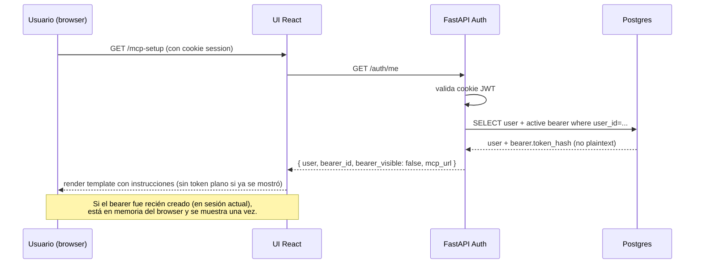
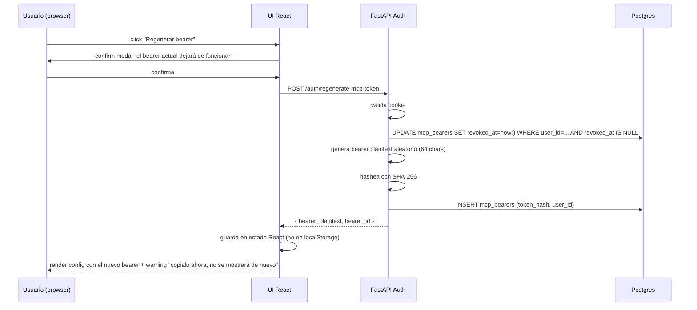

# FL-MCP-01 — Configuración del MCP Server por el usuario

## 1. Objetivo

Permitir al usuario logueado obtener la configuración necesaria para conectar su Claude Code o Claude Desktop al MCP server, incluyendo la URL del endpoint y un bearer token personal. Permitir regenerar el bearer si se compromete.

## 2. Alcance

**In**: render de `/mcp-setup` con datos del user logueado; mostrar URL MCP + bearer (la primera vez visible, después del re-render solo el hash); copiar config para Claude Code (`.mcp.json`) y Claude Desktop (`claude_desktop_config.json`); regenerar bearer (revoca el anterior).

**Out**: gestión avanzada de bearers múltiples por user (en MVP solo uno activo); auditing detallado de uso del bearer; integración directa con Claude (instalar config remoto).

## 3. Actores y ownership

| Actor | Ownership |
|---|---|
| Usuario | Logueado vía cookie web; ve y copia su config. |
| UI React | Renderiza `/mcp-setup`; muestra config; ofrece botón "regenerar bearer". |
| FastAPI Auth | Endpoint `/auth/me` (datos del user actual) y `POST /auth/regenerate-mcp-token`. |
| Postgres | Almacena `mcp_bearers`. |

## 4. Precondiciones

1. Usuario logueado (cookie de sesión válida).
2. Existe un bearer activo en `mcp_bearers` del user (creado al primer login en FL-AUTH-01).
3. `BASE_URL` del backend conocida (configurado en env var).

## 5. Postcondiciones

**Camino "ver config"**:
- UI muestra URL MCP, bearer (solo si está en estado "recién creado", como string en memoria), y snippets para Claude Code y Desktop.
- No hay cambio en Postgres.

**Camino "regenerar bearer"**:
- El bearer anterior queda revocado (`revoked_at = now()`).
- Nuevo registro en `mcp_bearers` con `token_hash` distinto y `revoked_at IS NULL`.
- UI muestra el nuevo bearer (visible una sola vez).
- Claude Code/Desktop con el bearer viejo recibirán 401 en sus próximas llamadas.

## 6. Secuencia principal — ver config

## 7. Secuencia principal — regenerar bearer

## 8. Camino alternativo / errores

| Condición | Manejo |
|---|---|
| Cookie ausente o JWT inválido | 401; UI redirige a `/login` |
| User logueado pero sin bearer activo (caso raro: borrado manual) | API crea uno nuevo automáticamente y lo retorna; log `mcp_bearer_generated` |
| `regenerate` falla por DB error | 500; UI muestra "intentar de nuevo"; el bearer viejo permanece activo |
| Doble click en regenerar (race) | UPDATE con condición `revoked_at IS NULL`: solo afecta el activo; segundo INSERT puede crear dos nuevos. Mitigación: lock pesimista o índice parcial UNIQUE WHERE `revoked_at IS NULL` |

## 9. Slice de arquitectura

Componentes activados:
- A. UI React (`/mcp-setup`).
- B. Servicio de Autenticación (`/auth/me`, `/auth/regenerate-mcp-token`).
- G. Persistencia Relacional (`mcp_bearers`).

ADRs aplicables: [ADR-009](../ADR/ADR-009.md), [ADR-010](../ADR/ADR-010.md), [ADR-011](../ADR/ADR-011.md).

## 10. Touchpoints de datos

**Entidades**: `mcp_bearers` (INSERT al regenerar, UPDATE al revocar el viejo).

**Eventos de log**: `mcp_bearer_generated`, `mcp_bearer_revoked`.

**Datos sensibles**: el bearer plaintext **nunca** se persiste en Postgres ni en logs. Solo el `token_hash`.

## 11. RF candidatos

| RF candidato | Cubre |
|---|---|
| RF-UI-01 | Renderizar `/mcp-setup` con datos del user actual |
| RF-UI-02 | Mostrar config para Claude Code y Claude Desktop con copy-to-clipboard |
| RF-AUTH-06 | `GET /auth/me` retorna user actual + bearer_id activo (sin plaintext) |
| RF-AUTH-07 | `POST /auth/regenerate-mcp-token` revoca el actual y emite uno nuevo (plaintext en respuesta única) |

## 12. Cuellos de botella, riesgos y mitigaciones

| Riesgo | Mitigación |
|---|---|
| User pierde el bearer y no puede recuperarlo | Tiene que regenerar (los Claude Code/Desktop quedan momentáneamente sin acceso hasta reconfig) |
| Bearer leakeado en captura de pantalla compartida | UI muestra warning; user regenera al detectar |
| Race en regenerar simultáneo | Constraint UNIQUE WHERE `revoked_at IS NULL` en Postgres asegura un único activo |

## 13. RF handoff checklist

- [x] Actores y ownership explícitos.
- [x] Diagramas mermaid de los dos caminos.
- [x] Errores documentados.
- [x] Eventos clave listados.
- [x] Riesgos y mitigaciones explícitos.
- [x] RFs candidatos enumerados.
- [x] No hay decisiones críticas abiertas.
- [x] Listo para `crear-rf`.
