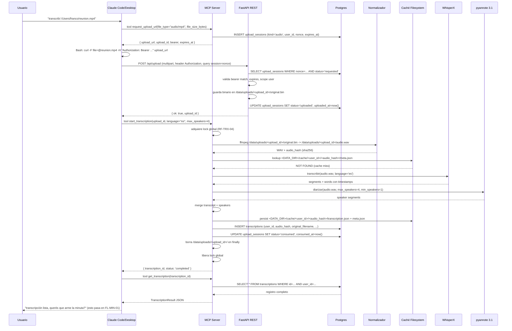
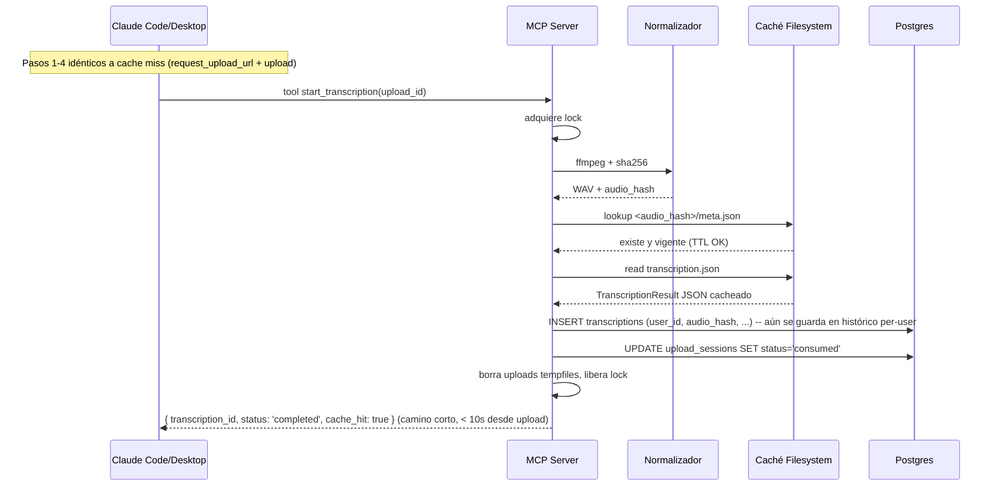

# FL-TRX-01 — Transcribir y diarizar archivo de audio iniciado desde Claude

## 1. Objetivo

El usuario, desde su Claude Code o Claude Desktop, le pasa un archivo de audio o video. Claude orquesta el upload al backend vía REST y dispara el pipeline vía MCP. El backend procesa (cache hit o miss), persiste el resultado en Postgres asociado al user, y devuelve el JSON al Claude para uso posterior (ver FL-MIN-01).

## 2. Alcance

**In**: archivos MP4, MP3, WAV, M4A, FLAC con audio en español rioplatense, duración ≤ 2 h, tamaño ≤ 500 MB. Cobertura del camino cache miss y cache hit. Persistencia simultánea en filesystem cache (efímero) y Postgres (histórico).

**Out**: live transcription, generación de minutas (FL-MIN-01), idiomas distintos a español, archivos > 500 MB, casos donde el user use otra UI distinta a Claude (la UI web no soporta upload de audio en MVP).

## 3. Actores y ownership

| Actor | Ownership |
|---|---|
| Usuario | Le pasa archivo a su Claude. |
| Claude Code/Desktop | Cliente MCP; obtiene signed URL, sube vía curl/HTTP, llama tools. |
| MCP Server | Tools `request_upload_url`, `start_transcription`, `get_transcription`. |
| FastAPI REST | Endpoint `POST /api/upload`. |
| Normalizador | ffmpeg + SHA-256. |
| Caché Filesystem | Lookup y persist por audio_hash. |
| Motor de Transcripción (WhisperX) | STT en GPU. |
| Motor de Diarización (pyannote) | Speaker labels en GPU. |
| Ensamblador | Merge transcript + speakers. |
| Postgres | INSERT en `transcriptions` (histórico per-user). |

## 4. Precondiciones

1. User logueado y bearer MCP válido configurado en su Claude.
2. Servicio FastAPI activo, modelos cargados en VRAM, Postgres reachable (verificable en `GET /api/health`).
3. Lock global libre o disponible en ≤ 5 s (ADR-005).
4. Disco con ≥ 100 MB libres en `<DATA_DIR>/cache/` y `<DATA_DIR>/uploads/`.
5. El audio del cliente puede o no existir en caché vigente; ambos caminos (hit/miss) son válidos.

## 6. Secuencia principal — Cache miss

## 7. Camino alternativo — Cache hit

## 8. Caminos de error (tabla)

| Condición | Punto de detección | Respuesta | Side effects |
|---|---|---|---|
| Bearer MCP inválido o revocado | MCP middleware en cada tool call | 401 + `MCP_BEARER_INVALID` | Sin cambios |
| Bearer válido pero user no autorizado para ese recurso | Per-user scoping en SQL queries | 404 + `TRANSCRIPTION_NOT_FOUND` (no 403, evita info leak) | Sin cambios |
| Archivo vacío o corrupto post-upload | Normalizador (ffmpeg falla) | MCP `start_transcription` responde error `INVALID_FORMAT` | upload_session pasa a `consumed` con failure flag; uploads tempfiles borrados |
| Archivo > 500 MB | API en `request_upload_url` (rechazo temprano) | MCP responde `FILE_TOO_LARGE` | Sin upload_session creado |
| Lock ocupado por otro request | MCP `start_transcription` | 503 + `LOCK_BUSY` con `Retry-After: 600` | upload_session permanece en `uploaded`; user puede reintentar |
| CUDA OOM en STT o diarización | Motor STT/Diar | MCP responde 500 + `CUDA_OOM` con `stage` | Lock liberado; uploads tempfiles borrados; transaction rollback Postgres |
| Postgres no reachable | Cualquier write | MCP responde 503 + `INTERNAL_ERROR`; el resultado NO se persiste; cache filesystem sí | Reintento por parte del cliente |
| Disco lleno al persistir caché | Caché Filesystem | Log WARN `cache_persist_failed`; **pero** transcription se devuelve igual y se persiste en Postgres | Próxima request idéntica será cache miss; recomputa |
| Postgres OK pero filesystem cache falla | Caché Filesystem | Log WARN; transcription_id retornado igual | Idem |
| `upload_id` desconocido o expirado | `start_transcription` | 404 + `UPLOAD_SESSION_NOT_FOUND` | Sin cambios |
| `upload_id` ya consumido | `start_transcription` | 409 + `UPLOAD_SESSION_ALREADY_CONSUMED` | Sin cambios |

## 9. Slice de arquitectura

Componentes activados (de [`02_arquitectura.md`](../02_arquitectura.md) §3):
- C. MCP Server (orquestador).
- D. REST endpoints (`/api/upload`).
- E. Normalizador.
- F. Caché Filesystem (lectura + escritura).
- G. Persistencia Relacional (Postgres).
- H. Motor de Transcripción (cache miss).
- I. Motor de Diarización (cache miss).
- J. Ensamblador (cache miss).

ADRs aplicables: [ADR-001](../ADR/ADR-001.md), [ADR-002](../ADR/ADR-002.md), [ADR-003](../ADR/ADR-003.md), [ADR-004](../ADR/ADR-004.md), [ADR-005](../ADR/ADR-005.md), [ADR-007](../ADR/ADR-007.md), [ADR-008](../ADR/ADR-008.md), [ADR-011](../ADR/ADR-011.md), [ADR-013](../ADR/ADR-013.md).

## 10. Touchpoints de datos

**Entidades**: `upload_sessions` (INSERT + 2 UPDATEs), `transcriptions` (INSERT en miss y hit), filesystem cache (read/write).

**Filesystem temporal**: `<DATA_DIR>/uploads/<upload_id>/original.bin` (borrado en finally), `audio.wav` (idem).

**Eventos de log** (de [`05_modelo_datos.md`](../05_modelo_datos.md) §7): `mcp_request_received`, `upload_url_requested`, `upload_received`, `audio_normalized`, `cache_lookup`, `stt_completed`, `diarize_completed`, `merge_completed`, `cache_persisted`, `transcription_persisted`, `mcp_request_completed`.

## 11. RF candidatos

| RF candidato | Cubre |
|---|---|
| RF-MCP-01 | Tool `request_upload_url`: validación + INSERT `upload_sessions` |
| RF-TRX-01 (revisado) | Pipeline cache miss invocado por tool `start_transcription` |
| RF-TRX-02 (revisado) | Cache hit con persistencia en Postgres histórico igual |
| RF-TRX-03 | Validación de formato y tamaño (en `request_upload_url`) |
| RF-TRX-04 | Lock global durante el pipeline |
| RF-TRX-05 | Manejo de CUDA OOM y model failure |
| RF-TRX-06 | Persistencia tolerante (filesystem cache puede fallar; Postgres es crítico) |
| RF-MCP-02 | Tool `start_transcription`: orquesta validación, lock, pipeline, persistencia |
| RF-MCP-03 | Endpoint REST `POST /api/upload`: valida session, escribe binario |

## 12. Cuellos de botella, riesgos y mitigaciones

| Riesgo | Mitigación |
|---|---|
| Lock global limita throughput a ~5 reuniones/h | Aceptable a 20/mes; reevaluar si volumen sube |
| Cache hit sigue persistiendo en Postgres → costo extra mínimo | Aceptable: mantener histórico per-user es el feature |
| Upload de archivos grandes excede timeout HTTP | Aumentar timeout a 30 min en uvicorn; documentar |
| `upload_session` queda huérfana si el user abandona post-request_upload_url | Cleanup periódico borra sessions con `status='requested'` y `expires_at < now()` (RF-CACHE-04 nuevo) |
| Distintos users con mismo audio_hash | El filesystem cache es compartido (idempotencia), pero Postgres tiene un registro por user (cada uno ve solo el suyo) |

## 13. RF handoff checklist

- [x] Actores y ownership explícitos.
- [x] Diagrama mermaid principal y alternativo.
- [x] Camino de error documentado.
- [x] Estados y eventos clave listados.
- [x] Cuellos de botella y mitigaciones explícitos.
- [x] RFs candidatos enumerados.
- [x] No hay decisiones críticas abiertas.
- [x] Listo para `crear-rf`.
